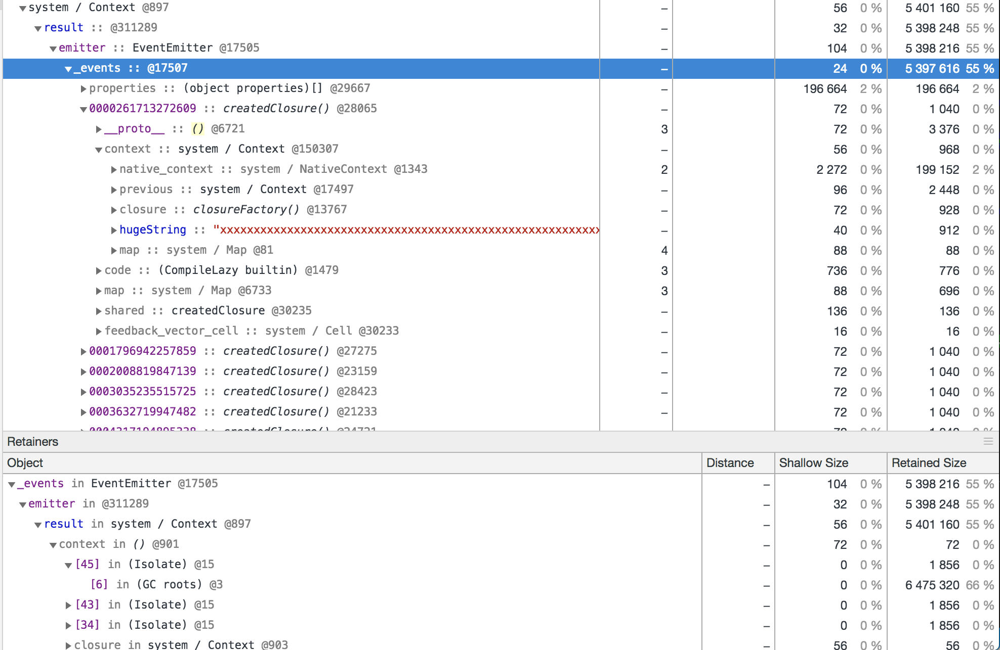

# Eclipse Memory Analyzer port for V8 heap snapshots

This project implements the algorithm used by the Eclipse Memory Analyzer on V8
heap snapshots to automatically detect leak suspects in JavaScript processes. It
analyzes a heap snapshot to find:

1. Leak suspect: an object that retains a big chunk of memory in the heap. Due to the
  nature of JavaScript applications this tend to be a context object of a closure.
2. Accumulation point: an object retained by the leak suspect where the majority of the
  memory retained by that suspect is accumulated.

The leak identified by this tool can be fixed by breaking the reference somewhere in the path
from the leak suspect to the accumulation point, or stop the accumulation point from accumulating
memory.

## Usage

```
npm install -g v8-mat
v8-mat path/to.heapsnapshot [path/to/result.json]
```

## Example

The following Node.js script leaks memory by adding listeners that retain large strings
to an emitter. It then create a snapshot before exiting.

```js
'use strict';

const inspector = require('inspector');
const fs = require('fs');
const EventEmitter = require('events');
const session = new inspector.Session();
session.connect();

const TIME = parseInt(process.argv[2] || 10);

function randomString() {
  return Math.random().toFixed(16).slice(2);
}

function run() {
  function closureFactory() {
    const hugeString = 'x'.repeat(1e6);

    function unused() {
      return hugeString;
    }

    return function createdClosure() {
      // This is a bug of the VM
      return 'I retain the hugeString even though I do not reference it';
    };
  }
  const emitter = new EventEmitter();
  for (let i = 0; i < 5e3; ++i) {
    emitter.on(randomString(), closureFactory());
  }
  return Promise.resolve({
    emitter
  });
}

function teardown({ emitter }) {
  console.log(emitter.eventNames().length);
}

run().then(function onFullFilled(result) {
  setTimeout(() => {
    let buf = '';
    session.on('HeapProfiler.addHeapSnapshotChunk', function(res) {
      buf += res.params.chunk;
    });
    session.post('HeapProfiler.takeHeapSnapshot', () => {
      const file = './event-emitter.heapsnapshot';
      fs.writeFileSync(file, buf);
      console.log(`Written snapshot to ${file}`);
      teardown(result);
    });
  }, TIME * 1000);
});
```

Running `v8-mat` on the generated `event-emitter.heapsnapshot`:

```
> v8-mat event-emitter.heapsnapshot
Total Heap Size:  9817128
=============== Suspect ========
Name         : system / Context
Class Name   : system / Context
Edges Count  : 5
Retained Size: 5401160
Self Size    : 56
ID           : 897
=============== Accumulation Point ========
Name         : Object
Class Name   : Object
Edges Count  : 5003
Retained Size: 5397616
Self Size    : 24
ID           : 17507
=============== Retaining Path ========
5.1509MB system / Context@897
(context of onFullFilled() /Users/joyee/projects/v8-mat/test/fixtures/event-emitter.js) <--- Suspect
  |
  | ->result
  v
5.1482MB Object(Object) @311289
  |
  | .emitter
  v
5.1481MB EventEmitter(EventEmitter) @17505
  |
  | ._events
  v
5.1476MB Object(Object) @17507 <--- Accumulation Point
  |
  | {properties}
  v
192.0547KB (object properties)((array)) @29667
............
```

Explanation:

1. The leak suspect is the context of `onFullFilled()`, where the result of `run()`
  is passed into the scope as a variable named `result`.
  Obviously if `onFullFilled()` does not put the `result` into the scope,
  the leak will not exist since the `result` will not be referenced
  and can be garbage-collected.
  - Notice in the output of v8-mat, the annotation beside the first arrow (edge)
    displays the variable name `result` in the context.
  - v8-mat also tries to extract the function and the file where the closure context
    is created and display it in its output.
2. `result` has a member `.emitter` which is assigned at the end of `run`.
3. `result.emitter` has an internal member `._events` where Node.js stores the
  listeners.

Looking up the suspect and following the retaining path from the suspect to the accumulation point
in the DevTools:




## Reference

- [Memory Analysis Simplified: Automated Heap Dump Analysis](https://www.eclipsecon.org/2008/sub/attachments/Memory_Analysis_Simplified_Automated_Heap_Dump_Analysis_for_Developers_Testers_and_Technical_Support_Employees.pdf)
- [Eclipse Memory Analyzer](https://www.eclipse.org/mat/)
